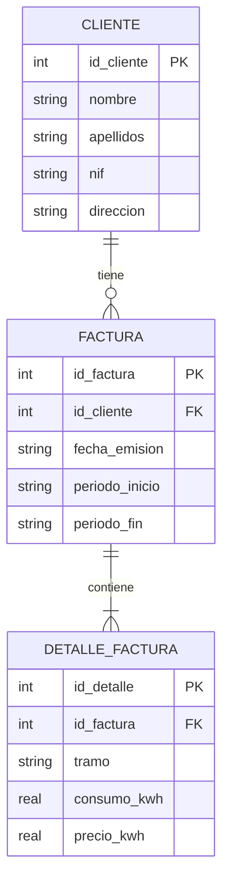

# Documentación Técnica de la Base de Datos - ElectroFactura

## 1. Introducción
La persistencia de datos se realiza mediante **SQLite**, una base de datos relacional ligera almacenada en un único archivo local (`electricity.db`).

## 2. Diagrama Entidad-Relación (ER)



## 3. Definición de Tablas

### 3.1 Tabla `CLIENTE`
Almacena la información personal de los abonados.

| Columna | Tipo | Restricciones | Descripción |
| :--- | :--- | :--- | :--- |
| `id_cliente` | INTEGER | PRIMARY KEY AUTOINCREMENT | Identificador único. |
| `nombre` | TEXT | - | Nombre de pila. |
| `apellidos` | TEXT | - | Apellidos completos. |
| `nif` | TEXT | - | Identificación fiscal. |
| `direccion` | TEXT | - | Dirección postal. |

### 3.2 Tabla `FACTURA`
Representa el documento de facturación emitido.

| Columna | Tipo | Restricciones | Descripción |
| :--- | :--- | :--- | :--- |
| `id_factura` | INTEGER | PRIMARY KEY AUTOINCREMENT | Identificador único. |
| `id_cliente` | INTEGER | FOREIGN KEY (CLIENTE) | Cliente asociado. |
| `fecha_emision` | TEXT | - | Fecha de expedición (ISO 8601). |
| `periodo_inicio` | TEXT | - | Inicio del rango facturado. |
| `periodo_fin` | TEXT | - | Fin del rango facturado. |

### 3.3 Tabla `DETALLE_FACTURA`
Desglosa los consumos por tramos horarios dentro de una factura.

| Columna | Tipo | Restricciones | Descripción |
| :--- | :--- | :--- | :--- |
| `id_detalle` | INTEGER | PRIMARY KEY AUTOINCREMENT | Identificador único. |
| `id_factura` | INTEGER | FOREIGN KEY (FACTURA) | Factura a la que pertenece. |
| `tramo` | TEXT | - | Nombre del tramo (Punta, Llano, Valle). |
| `consumo_kwh` | REAL | - | Energía consumida. |
| `precio_kwh` | REAL | - | Tarifa aplicada. |

## 4. Inicialización
La clase `DatabaseManager` se encarga de crear estas tablas automáticamente al iniciar la aplicación si no existen:

```java
public void crearTablasSiNoExisten() {
    String sqlC = "CREATE TABLE IF NOT EXISTS CLIENTE ...";
    String sqlF = "CREATE TABLE IF NOT EXISTS FACTURA ...";
    String sqlD = "CREATE TABLE IF NOT EXISTS DETALLE_FACTURA ...";
    // ... ejecución de sentencias ...
}
```
